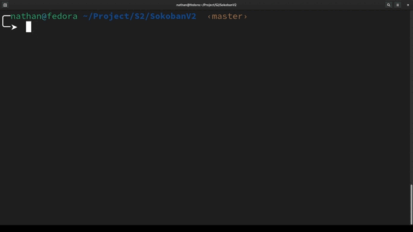

# MySokoban

In this project, you are asked to make a small video game based on the rules of a finite [SOKOBAN](https://fr.wikipedia.org/wiki/Sokoban).


## Installation


```bash
make
```

## Usage

```bash
./my_sokoban map
```
## Demo

